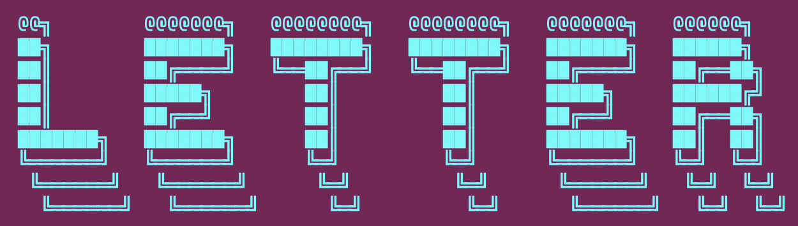

# Letter: An ASCII art generator program. Covert strings to huge ASCII letter banners for project splash screens.



Date: 30 March 2025

Oliver Bonham-Carter

Email: obonhamcarter at allegheny.edu

This `README.md` file provides a comprehensive explanation of the project, including how to use it, examples, and instructions for adding more characters. It also includes sections for contributing and licensing.

**Letter** is a Rust program that generates large ASCII art for input strings. It uses predefined ASCII art representations of letters to create visually appealing text.

## Features

- Converts any English word or string into ASCII art.
- Supports command-line arguments for input and output filenames.
- Automatically generates a unique filename if the specified output file already exists.
- Displays helpful warnings if a character is not supported.
- Provides a built-in help message when no arguments are provided.

## Requirements

- Rust (version 1.65 or later)
- The `clap` crate for command-line argument parsing.

## Installation

1. Clone this repository:
   ```bash
   git clone git@github.com:developmentAC/letter.git
   cd letter
   ```

2. Build the project:
   ```bash
   cargo build --release
   ```

3. Run the program:
   ```bash
   cargo run --release
   ```

   or, for compiled projects:

   ```bash
   ./target/release/letter
   ```

4. To generate ASCII art for a specific word (such as "hello") and save it to a file, pass the input string and optionally specify an output filename:
   ```bash
   cargo run --release -- hello -o output.txt
   ```

   or, for compiled projects:

   ```bash
   ./target/release/letter hello

And you will see the following output:

   ``` bash
██╗  ██╗███████╗██╗     ██╗      ██████╗ 
██║  ██║██╔════╝██║     ██║     ██╔═══██╗
███████║█████╗  ██║     ██║     ██║   ██║
██╔══██║██╔══╝  ██║     ██║     ██║   ██║
██║  ██║███████╗███████╗███████╗╚██████╔╝
╚═╝  ╚═╝╚══════╝╚══════╝╚══════╝ ╚═════╝ 
```

6. To display the help message:
   ```bash
   cargo run --release -- --help
   ```
   or
   ```bash
   ./target/release/letter --help
   ```

   Example output:
   ```text
   Generates large ASCII art for input strings

   Usage: letter_maker <input> [OPTIONS]

   Arguments:
     <input>  The string to convert to ASCII art

   Options:
     -o, --output <output>  The output filename (default: output.txt)
     -h, --help             Print help
     -V, --version          Print version
   ```

## How It Works

### Command-Line Argument Parsing

The program uses the `clap` crate to parse command-line arguments. It accepts two arguments:
1. **Input String**: The string to convert into ASCII art. This is a required argument.
2. **Output Filename**: The name of the file where the ASCII art will be saved. This is optional and defaults to `output.txt`.

If the output file already exists, the program generates a unique filename by appending a number to the original name (e.g., `output1.txt`, `output2.txt`, etc.).

### ASCII Art Data

The ASCII art for each letter is stored in a `HashMap` in the `get_letter_data` function. Each letter is represented as a vector of strings, where each string corresponds to a row of the ASCII lettering.

For example, the letter `A` is represented as:
```rust
vec![
    "    ███╗   ", 
    "   ████╗   ", 
    "  ██╔██╗   ", 
    " ██╔╝██╗   ", 
    "███████╗   ", 
    "╚══════╝   ",
]
```

The rest of the letters have been defined similarly in the code.

### Output Generation

1. The program iterates over each character in the input string.
2. For each character, it retrieves the corresponding ASCII art from the `HashMap`.
3. If a character is not found in the `HashMap`, a warning is displayed, and the character is skipped.
4. The ASCII art for all characters is combined into a single output.

### Directory Management

The program ensures that the output directory (`0_out/`) exists before saving the file. If the directory does not exist, it is created automatically.

### Unique Filename Generation

The program checks if the specified output file already exists. If it does, a new filename is generated by appending a number to the original name. This process continues until a unique filename is found.

For example:
- If `output.txt` exists, the program creates `output1.txt`.
- If `output1.txt` also exists, it creates `output2.txt`, and so on.

### Warnings

If a character in the input string is not found in the `HashMap`, the program prints a warning message. For example:
```text
Warning: Character '$' not found in letter data.
```

## Example Output

For the input string `HELLO`, the program generates the following ASCII art:

```text
██╗  ██╗███████╗██╗     ██╗      ██████╗ 
██║  ██║██╔════╝██║     ██║     ██╔═══██╗
███████║█████╗  ██║     ██║     ██║   ██║
██╔══██║██╔══╝  ██║     ██║     ██║   ██║
██║  ██║███████╗███████╗███████╗╚██████╔╝
╚═╝  ╚═╝╚══════╝╚══════╝╚══════╝ ╚═════╝ 
```

The output is saved to the specified file in the `0_out/` directory.

## Adding More Characters

To add support for additional characters, modify the `get_letter_data` function in `src/main.rs`. Add a new entry to the `HashMap` for each character, following the existing format.

For example, to add the character `@`:
```rust
map.insert(
    '@',
    vec![
" ██████╗   ",
"██╔═══██╗  ",
"██║██╗██║  ",
"██║██║██║  ",
"╚█║████╔╝  ",
" ╚╝╚═══╝   ",    ],
);
```

Make sure to define the ASCII art representation for the new character in a similar manner as the existing characters.

## License

This project is licensed under the MIT License. See the LICENSE file for details.

## Contributing

Contributions are welcome! If you have ideas for improvements or want to add more features, feel free to open an issue or submit a pull request.

### A Work In Progress

Check back often to see the evolution of the project! **Letter** is a work-in-progress. Updates will come periodically.

If you would like to contribute to this project, please do! For instance, if you see some low-hanging fruit or tasks that could add value to the project, I would love to have your insight.

Otherwise, please create an issue for bugs or errors. Since I am a teaching faculty member at Allegheny College, I may not have all the time necessary to quickly fix bugs. I welcome the Open Source Community to further the development of this project. Much thanks in advance.

If you appreciate this project, please consider clicking the project's Star button. :-)
